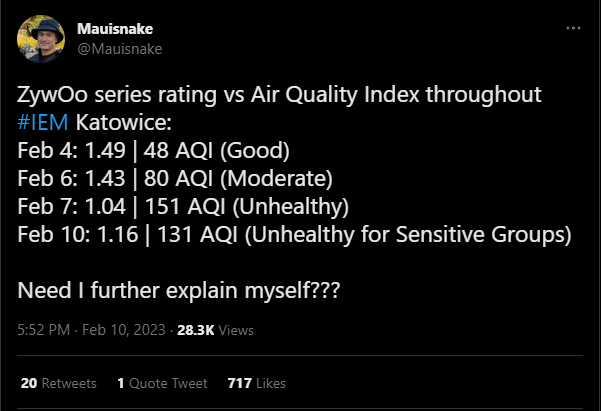

<h1 align="center">zywoo-forecast</h1>

  

  <a href="https://www.journals.uchicago.edu/doi/full/10.1086/698728">
    Related research: Environmental Conditions & Human Performance
  </a>

## Overview

ML project exploring whether environmental conditions can help predict ZywOo's CS2 performance.

### Data Sources

- CS2 performance & match location data collected from [HLTV](https://www.hltv.org/) using a private scraper.
- Historical air quality measurements collected from [OpenAQ](https://openaq.org/).
- Historical weather data collected from [Open-Meteo](https://open-meteo.com/).
- Forecast air quality and weather data collected from [Open-Meteo](https://open-meteo.com/).

> **Limitation:** The model was trained on historical observed weather data, not historical weather forecasts.

## Try It Here

**[Launch the ZywOo Forecast](https://kevbot404.github.io/zywoo-forecast/)**

## Features Used for Prediction

The model uses the following features to predict rating:

- **Location & Terrain:** `elevation`

- **Air Quality:** `no2`, `o3`, `pm10`, `pm25`

- **Temperature:** `temperature_2m_max`, `temperature_2m_min`, `temperature_2m_mean`, `apparent_temperature_max`, `apparent_temperature_min`, `apparent_temperature_mean`

- **Sunlight & Radiation:** `daylight_duration`, `sunshine_duration`, `shortwave_radiation_sum`

- **Precipitation & Snow:** `rain_sum`, `snowfall_sum`, `precipitation_sum`, `precipitation_hours`, `snowfall_water_equivalent_sum`

- **Wind:** `wind_speed_10m_max`, `wind_speed_10m_mean`, `wind_speed_10m_min`, `wind_gusts_10m_max`, `wind_gusts_10m_mean`, `wind_gusts_10m_min`, `wind_direction_10m_dominant`

- **Cloud Cover:** `cloud_cover_mean`, `cloud_cover_max`, `cloud_cover_min`

- **Humidity & Moisture:** `relative_humidity_2m_mean`, `relative_humidity_2m_max`, `relative_humidity_2m_min`, `dew_point_2m_min`, `dew_point_2m_max`, `dew_point_2m_mean`, `wet_bulb_temperature_2m_mean`, `wet_bulb_temperature_2m_max`, `wet_bulb_temperature_2m_min`, `vapour_pressure_deficit_max`

- **Atmospheric Pressure:** `pressure_msl_mean`, `pressure_msl_max`, `pressure_msl_min`, `surface_pressure_mean`, `surface_pressure_max`, `surface_pressure_min`

- **Evapotranspiration:** `et0_fao_evapotranspiration`, `et0_fao_evapotranspiration_sum`

## Model Details

| Parameter  | Value         |
| ---------- | ------------- |
| Algorithm  | Random Forest |
| Estimators | 200           |
| Features   | 47            |
| Test Split | 20%           |

## Results

The model showed that environmental conditions provide little to no useful signal for predicting a CS2 player's performance. At this stage, a random number generator might genuinely do better than the model.

| Metric | Value   |
| ------ | ------- |
| MAE    | 0.3579  |
| RMSE   | 0.4538  |
| R²     | -0.1474 |

## Other Model Results:

> Environmental conditions appear to have almost no measurable relationship with ZywOo's CS2 performance, and the simplest model is the least bad because the available signal is extremely weak.

| Model                  | MAE      | RMSE     | R2        |
| ---------------------- | -------- | -------- | --------- |
| Linear Regression      | 0.352440 | 0.437626 | -0.066898 |
| Ridge                  | 0.363758 | 0.451611 | -0.136176 |
| CatBoost               | 0.364188 | 0.459625 | -0.176859 |
| Gradient Boosting      | 0.365568 | 0.466733 | -0.213542 |
| LightGBM               | 0.385893 | 0.491814 | -0.347471 |
| Hist Gradient Boosting | 0.386029 | 0.493591 | -0.357226 |
| XGBoost                | 0.396099 | 0.501186 | -0.399316 |
| Extra Trees            | 0.396509 | 0.503730 | -0.413556 |

## Recorded Predictions:

|    Date    | Location       | Opponent |    Model | Actual | Difference |
| :--------: | :------------- | -------- | -------: | :----: | :--------: |
| 29.08.2026 | **Copenhagen** | 9z       |  **1.31**  |  1.82  |  **0.51**  |
| 30.08.2026 | **Copenhagen** | Legacy   |  **1.30**  |  1.19  |  **0.11**  |
| 31.08.2026 | **Copenhagen** | FUT      |  **1.35**  |  1.43  |  **0.08**  |
| 04.09.2026 | **Porto**      | FURIA    |  **1.32**  |  1.18  |  **0.14**  |
| 05.09.2026 | **Porto**      | MOUZ     |  **1.39**  |        |            |

